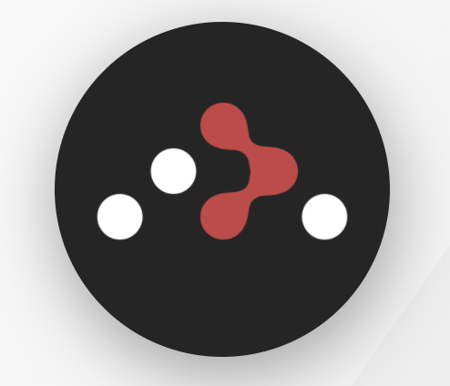
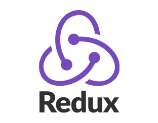
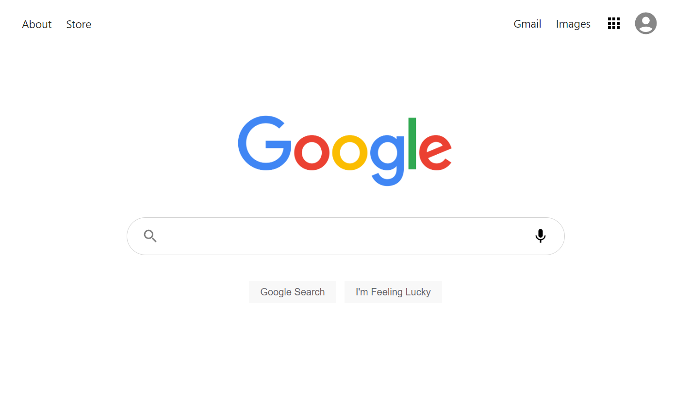
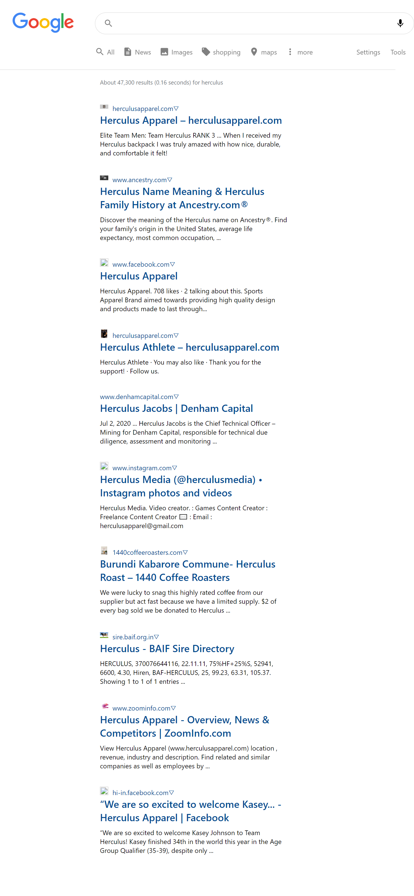

# **GOOGLE CLONE**


The project contains clone of website Google . This is a fully responsive clone of Google home page and search page build purely with React Js, Redux, React Router, Material UI Icons. Utilised the efficient power of React Js to build this fully responsive clone. Learnt to use React Js, Redux, React Router v6 to build production ready UI's in minimum time possible.


# Technologies Used
 `CSS`


 `REACT`


 `REACT ROUTER`


 `REDUX`


 `Material UI`
# Features
 - Build over React Js, React Router, Redux
 - Clean and Beautiful UI Design
 - Fully Responsive Mobile Design
 # Website
 ## Desktop Version
 
 
 # Links
 The deployed site might not have all features working due to developer plan of Api which only allows free services in the localhost and not on the deployed version.
 ## Run Locally

Clone the project

create a react app

delete your src file and add this src file there

open the react app with vs code

Go to the project directory

Install dependencies react router, redux and material ui library

Start the server

```bash
  npm run start
```
 # Contact
 [](https://www.linkedin.com/in/avinash-chandra-12540020b/)`https://www.linkedin.com/in/avinash-chandra-12540020b/`
 
 
 `avinashchandrabarik01@gmail.com`
